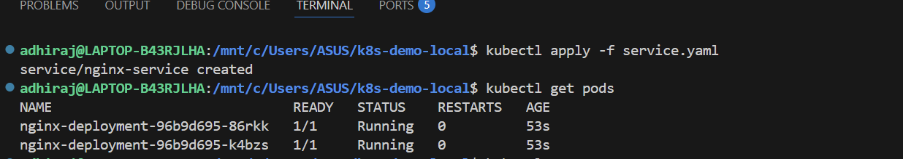
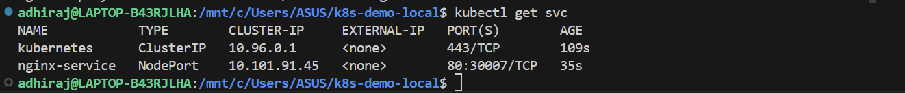
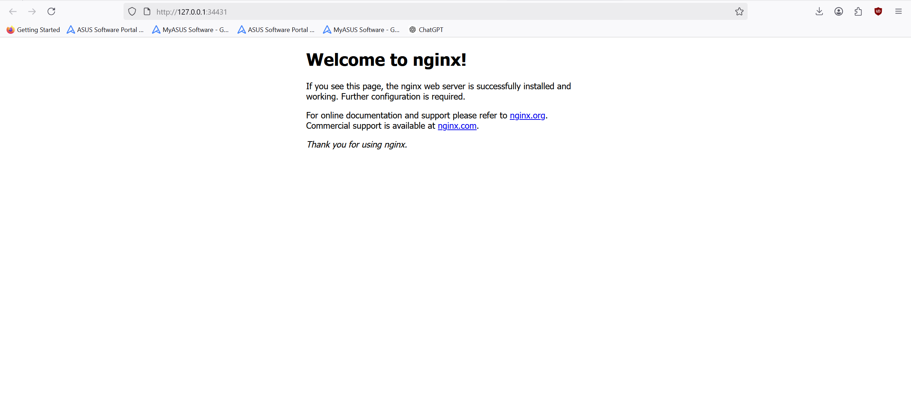
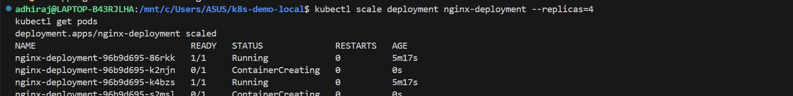
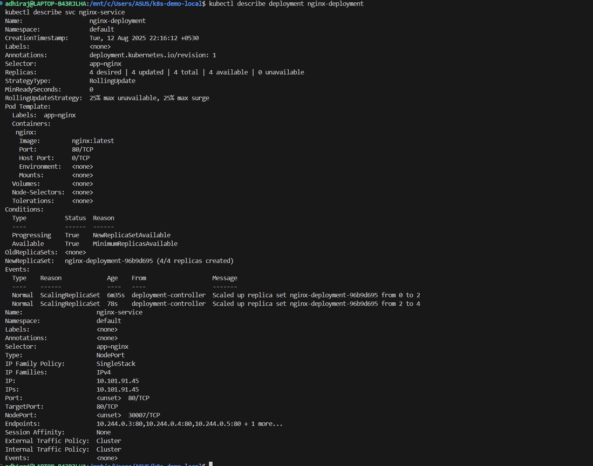

# k8s-demo-minikube
Build a Kubernetes Cluster Locally with Minikube
## Tools Used
- Minikube
- kubectl
- Docker

---

## Steps Performed

1. Installed Minikube and started the Kubernetes cluster using the Docker driver.  
2. Verified the cluster was running.  
3. Created a Kubernetes Deployment manifest (`deployment.yaml`) for the Nginx application.  
4. Applied the deployment to the cluster.  
5. Created a Kubernetes Service manifest (`service.yaml`) of type NodePort to expose the Nginx application.  
6. Applied the service configuration to the cluster.  
7. Verified the running pods and services.  
     
     
8. Accessed the application in a web browser using the Minikube IP and NodePort.  
     
9. Scaled the deployment from 2 replicas to 4 replicas.  
10. Verified scaling by listing all pods again.  
      
11. Described the deployment and service to view detailed configuration and status.  
      
12. Checked pod logs for application output.  